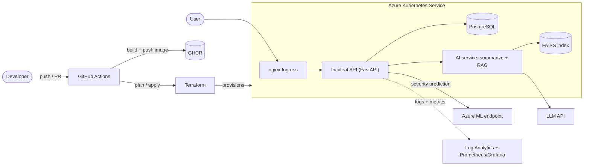

# Incident Copilot: Project Brief

**Author:** Harshithapmane · **Started:** 23-Sep-2026 · **Repo:** `incident-copilot`

## What it does
Incident Copilot is a REST service for logging and searching operational incidents (title, severity, symptoms, root cause, fix). It grows across the 100 Days of DevOps program into a full platform:

- **Core API:** create, list and fetch incidents.
- **AI feature:** summarizes an incident, and answers "have we seen this before?" using RAG over past incidents.
- **ML feature:** a small model suggests severity and category from the description text.

It doubles as a real tool: the same incident log I keep while learning becomes the app's data. The point of the project is the **delivery pipeline around the app**, not the app itself.

**Users:** on-call engineers and small ops teams.
**v0 scope (Day 2):** `POST /incidents`, `GET /incidents`, `GET /incidents/{id}`, `GET /health`, with in-memory data.

## Tech stack
| Layer | Choice |
|---|---|
| App | Python 3.12, FastAPI, pytest |
| Data | In-memory, then SQLite, then PostgreSQL |
| Containers | Docker (multi-stage), Docker Compose, GHCR |
| Orchestration | Kubernetes (kind locally, AKS in Azure), nginx Ingress, HPA, NetworkPolicy |
| Infrastructure as Code | Terraform (azurerm), remote state in Azure Storage |
| CI/CD | GitHub Actions: build, test, push, `terraform plan`, gated apply |
| Observability | Structured logs to Azure Log Analytics, Prometheus + Grafana |
| AI / ML | LLM API, FAISS, scikit-learn, MLflow, Azure ML online endpoint |

## Architecture (target state)

*Built up in layers: app (P1), Docker (P2), Kubernetes (P3), Terraform + AKS (P4), CI/CD (P5), monitoring (P6), AI (P7), ML (P8).*

## Success criteria
By 31-Dec-2026 I can demo the whole stack live, end to end: `git push` triggers the pipeline, which deploys the API, AI feature and ML endpoint to AKS defined entirely in Terraform, with dashboards showing traffic. I can explain every design choice in an interview.

## Out of scope
Auth and multi-user accounts, a web UI, and multi-region or production-grade HA.
